# RoboSub v1 Repository

This repository currently contains my humble plans for RoboSub, an AUV competition held every July. No code in here yet; see docs/software-architecture.md for useful info. GitHub Issues tracklist coming soon. Also see docs/tasks.md for intended dev tasks.

## Overview

### High Level Architecture

## Contributing Reference

## Documentation Layout
Start with docs/Workplace_Setup.md

## Repository Layout

## Hardware Spec

## Software Architecture

### Key Components
Under construction

## What Next?
Dev container setup

