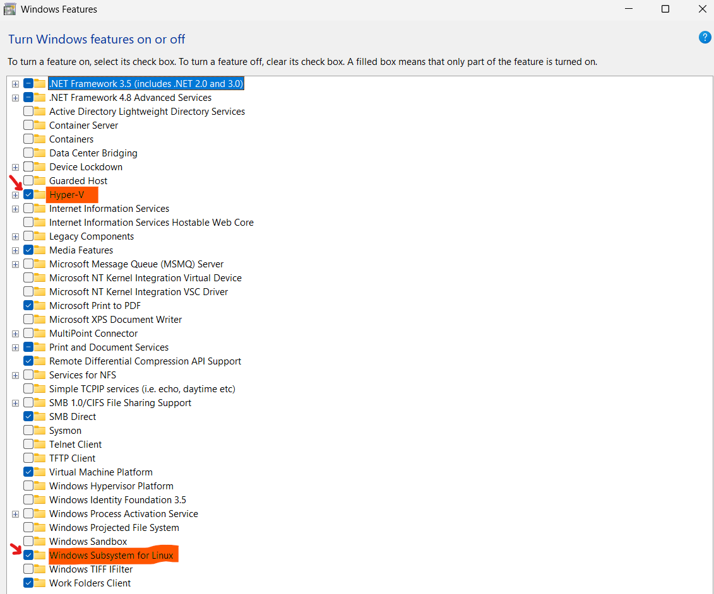
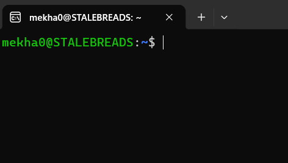

# Setup Instructions for Workspace

This document serves as a guide for setting up your workspace environment for the first time. It assumes you are using Windows 11. If you use something different, please figure it out on your own and document it here.

## Quick Overview
- Enable Hyper-V and Windows Subsystem for Linux (WSL 2)
    - Note: This is memory-heavy. On my laptop, it takes up a gigabyte
- Open WSL environment in VSCODE

## Actual Tutorials Written by Real People
For a better tutorial experience, see:

Windows 11: https://code.visualstudio.com/docs/remote/wsl <br>
macOS: https://github.com/idesign0/ros2_macos <br>
Linux: Just make sure you're running Ubuntu 24.04. <br>

## Windows Setup, Written by Me
### Step One: Turn on Hyper-V and Windows Subsystem for Linux
Press the windows key and search, "Turn windows features on or off." Click on it, and you'll get a window like this:<br>
  

Enable Hyper-V and Windows Subsystem for Linux, highlighted above; hit OK and your system should restart. It may take a while to complete

#### Step 2: Mount Ubuntu onto WSL
Before doing this, ensure nothing is already mounted. Do this by pressing the windows key and searching "WSL." If no terminal pops up, proceed. If a terminal does pop up, run "cat /etc/os-release". If it doesn't give you version info, proceed; if it says you're running "Ubuntu 24.04", skip to step 3; if it says any other ubuntu version, run "wsl --install -d Ubuntu-24.04".


Open up powershell with admin priviledges; then, type out "wsl --install -d Ubuntu-24.04". Wait for it to finish downloading.

### Step 3: Open Virtual Environment
Press the Windows key, and search "WSL." It should give you a terminal like this: <br>


We need to launch VSCode (or whatever default IDE you're using) from the WSL terminal. We make a project directory, clone the repo, and open it. Just type out what's below and you should get to your IDE.

Run the following commands:
```bash
mkdir projects
cd projects
git clone https://github.com/Mekha0/robosub-prototype.git
cd robosub-prototype
code .
```

VSCode should prompt you to download the "WSL Extension." Go ahead and do so.

### Step 4: Set Up Git Info
If you try committing something. you might get an error saying you need to configure user.name and user.emaill for git. To solve this, open a WSL terminal inside VSCode. Then, sub in your actual git username and email inside the placeholders:

```bash
git config user.name YOUR_USERNAME
git config user.email YOUR_EMAIL
```
Congrats! You have successfully opened up VSCode in a WSL environment. To confirm this, look at the bottom left corner; if it says "WSL: Ubuntu", then you're in the right spot!
