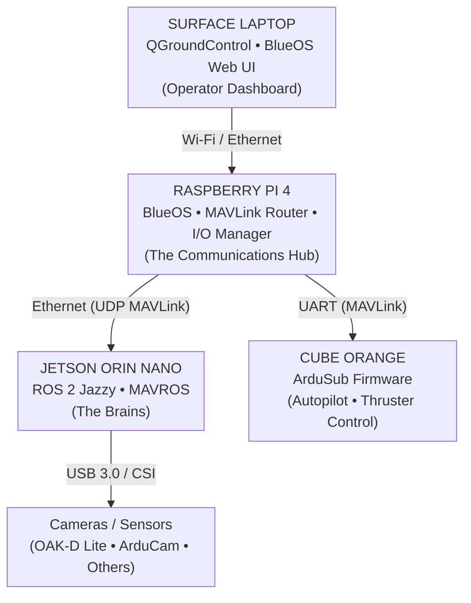

# RoboSub 2026/2027 - Software Component Cheat Sheet

## System Architecture Overview

---

## Core Software Components

### 1. **Jetson Orin Nano** (The Brains)

| Attribute | Description |
|-----------|-------------|
| **Role** | Primary computation node for autonomy, perception, and decision-making |
| **OS** | Ubuntu 24.04 LTS |
| **Middleware** | ROS 2 Jazzy |
| **Key Packages** | MAVROS, DepthAI ROS, OpenCV, ORB-SLAM3 |
| **Inputs** | OAK-D stereo camera (USB 3.0), ArduCam global shutter (USB 3.0) |
| **Outputs** | Velocity commands → Raspberry Pi (via MAVLink), mission state, telemetry |
| **Analogy** | The captain of the submarine who processes visual information, plans routes, and gives orders to the helmsman |

---

### 2. **Raspberry Pi 4** (The Communications Hub)

| Attribute | Description |
|-----------|-------------|
| **Role** | Bridge between all subsystems; handles I/O, fail-safes, and joystick passthrough |
| **OS** | BlueOS (custom Ubuntu-based OS for subsea vehicles) |
| **Key Services** | MAVLink Router, Web UI server, I/O Manager (Python) |
| **Inputs** | Joystick (USB), Jetson heartbeat (UART), sensors (I2C/GPIO) |
| **Outputs** | MAVLink commands → Cube Orange (UART), telemetry → BlueOS web UI |
| **Analogy** | The communications officer who relays the captain's commands to the helmsman, monitors the crew's vital signs, and alerts everyone to emergencies |

---

### 3. **Cube Orange** (The Autopilot)

| Attribute | Description |
|-----------|-------------|
| **Role** | Real-time vehicle control; runs low-level control loops and sensor fusion |
| **Firmware** | ArduSub 4.5+ |
| **Key Features** | PID control, EKF3 state estimation, thruster mixing, depth hold |
| **Inputs** | MAVLink commands (Raspberry Pi → UART), Bar30 depth sensor (I2C), IMU |
| **Outputs** | PWM signals → 8 thrusters, servo signals, MAVLink telemetry → Raspberry Pi |
| **Analogy** | The helmsman who physically turns the steering wheel, adjusts throttle, and keeps the submarine stable—executing commands at millisecond precision |

---

### 4. **MAVLink** (The Communication Protocol)

| Attribute | Description |
|-----------|-------------|
| **Definition** | Micro Air Vehicle Link - lightweight message protocol for communication with autopilots |
| **Version** | MAVLink 2.0 (binary serialization) |
| **Key Messages** | `HEARTBEAT` (system health), `MANUAL_CONTROL` (joystick), `VISION_POSITION_ESTIMATE` (position from Jetson), `SET_POSITION_TARGET` (velocity commands) |
| **Transport** | UART (115200 baud) between Raspberry Pi and Cube Orange; UDP to surface laptop |
| **Analogy** | The standard naval flag code that every ship understands—ensuring commands are unambiguous, reliable, and self-verifying |

---

### 5. **ROS 2 Jazzy** (The Orchestration Layer)

| Attribute | Description |
|-----------|-------------|
| **Definition** | Robot Operating System 2 - distributed communication middleware for robotics |
| **Version** | Jazzy (target release for Ubuntu 24.04) |
| **Key Features** | Publisher/subscriber messaging, services, actions, real-time capable |
| **Use Case** | Connects all Jetson nodes (perception, autonomy, control) with standard message types |
| **Key Topics** | `/imu`, `/depth`, `/camera/image`, `/vo_estimate`, `/cmd_vel`, `/vo_quality` |
| **Analogy** | The ship's internal PA system and message tubes—everyone in the command center (Jetson) talks on the same intercom, and every message goes to the right recipient automatically |

---

### 6. **ArduSub** (The Autopilot Firmware)

| Attribute | Description |
|-----------|-------------|
| **Definition** | Open-source autopilot firmware for ROVs/AUVs, based on ArduPilot |
| **Version** | 4.5+ |
| **Key Features** | EKF3 state estimation, PID control loops, MAVLink support, actuator mixing |
| **Configuration** | Mission Planner / QGroundControl for parameter tuning |
| **EKF3** | Extended Kalman Filter for sensor fusion (IMU, depth, compass, vision) |
| **Analogy** | The submarine's automated navigation computer—takes high-level commands (e.g., "go to 2m depth and head north") and executes them using raw thruster control, while fusing all sensor data for its own internal understanding of motion |

---

### 7. **ORB-SLAM3** (The Eyes)

| Attribute | Description |
|-----------|-------------|
| **Definition** | Visual Simultaneous Localization And Mapping - tracks camera position and builds a map of the environment |
| **Mode** | Stereo mode using OAK-D (left + right grayscale) |
| **Output** | 6-DOF position estimate (x, y, z, roll, pitch, yaw) at 30Hz |
| **Fallback** | KLT optical flow on ArduCam when feature count drops below threshold |
| **Analogy** | The navigation officer who looks out the periscope, recognizes visual landmarks, and calculates the submarine's position relative to known points in the environment |

---

### 8. **VO Quality Monitor** (The Integrity Checker)

| Attribute | Description |
|-----------|-------------|
| **Definition** | ROS 2 node that publishes a metric (0-1) indicating confidence in visual odometry |
| **Inputs** | Feature count, disparity variance, tracking stability, reprojection error |
| **Output** | `/vo_quality` topic (float) published to Autonomy layer |
| **Thresholds** | > 0.7 = Good, 0.3-0.7 = Degraded, < 0.3 = Failure |
| **Analogy** | The helmsman's second-in-command who says "Captain, I think my navigation plot is accurate" (0.9) or "Something's wrong, I can't trust my instruments" (0.1) |

---

### 9. **MAVROS** (The MAVLink Bridge)

| Attribute | Description |
|-----------|-------------|
| **Definition** | ROS 2 node that converts between MAVLink messages and ROS 2 topics |
| **Package** | `ros-jazzy-mavros` |
| **Key Topics** | `/mavros/imu/data`, `/mavros/global_position/rel_alt`, `/mavros/setpoint_velocity` |
| **Transport** | UDP (local) or serial (UART) |
| **Analogy** | The translator who sits between the captain (Jetson ROS nodes) and the helmsman (Cube Orange), converting ROS 2 commands into MAVLink flag code and decoding MAVLink telemetry into ROS 2 messages |

---

### 10. **BlueOS** (The Web Dashboard)

| Attribute | Description |
|-----------|-------------|
| **Definition** | Web-based operating system for Blue Robotics vehicles, runs on Raspberry Pi |
| **Features** | MAVLink Router, web UI for telemetry, extension system, REST API |
| **Access** | Surface laptop connects via Wi-Fi/Ethernet to web interface |
| **Analogy** | The bridge display panel showing all critical systems—depth, heading, speed, alarms, and video feeds—in one place for the captain to monitor |

---

### 11. **Behavior Tree** (The Decision System)

| Attribute | Description |
|-----------|-------------|
| **Definition** | Hierarchical decision-making system using `behaviortree_cpp_v3` |
| **Nodes** | Sequence, Fallback, Condition, Action, Decorator |
| **State vs. BT** | Phase 1 uses simple state machine (5 states); Phase 2 upgrades to Behavior Tree for complex task planning |
| **Analogy** | The captain's decision flowchart: "If we've passed the gate AND we're at depth, then proceed to buoys; IF we detect an obstacle, then avoid it; IF vision fails, then dead reckon for 10s, then re-acquire." |

---

### 12. **Current Disturbance Observer** (The Force Estimator)

| Attribute | Description |
|-----------|-------------|
| **Definition** | Control algorithm on Raspberry Pi that estimates water current effect on the vehicle |
| **Principle** | Compare desired velocity (from Jetson) vs. achieved velocity (from thrusters + IMU) |
| **Output** | Feedforward compensation added to velocity commands before MAVLink forwarding |
| **Analogy** | The helmsman who feels the current pushing against the submarine and automatically compensates the steering without waiting for orders, making the ride smoother in rough seas |

---

### 13. **EKF3** (The Fusion Engine)

| Attribute | Description |
|-----------|-------------|
| **Definition** | Extended Kalman Filter running on Cube Orange, fuses all sensor data |
| **Inputs** | IMU (accel + gyro), Bar30 depth, compass, vision position (via MAVLink) |
| **Output** | State estimate (position, velocity, attitude, biases) at 100Hz |
| **Conditional Fusion** | Only accepts vision data when `vo_quality > 0.5` |
| **Analogy** | The submarine's inertial navigation computer that combines the gyrocompass, depth gauge, and visual fixes to calculate a single, reliable estimate of where the submarine is in 3D space, even when any single sensor is noisy or fails |

---

### 14. **Docker** (The Portable Environment)

| Attribute | Description |
|-----------|-------------|
| **Definition** | Containerization platform for reproducible development environments |
| **Images** | `Dockerfile.ros` (Jetson), `Dockerfile.pi` (Raspberry Pi) |
| **Benefits** | All developers work in identical environments; eliminates "works on my machine" issues |
| **Analogy** | A standardized shipping container—everyone uses the exact same set of tools, libraries, and configurations, so software ships (and runs) identically on any developer's workstation or robot |

---

## Communication Flow Summary

| Direction | Protocol | Data Type | Description |
|-----------|----------|-----------|-------------|
| **Joystick → Raspberry Pi** | USB HID | Axis/button states | Pilot inputs to control vehicle |
| **Raspberry Pi → Cube Orange** | MAVLink over UART (115200 baud) | `MANUAL_CONTROL`, `SET_POSITION_TARGET` | High-level commands to autopilot |
| **Cube Orange → Raspberry Pi** | MAVLink over UART | `HEARTBEAT`, `ATTITUDE`, `POSITION` | Telemetry from autopilot |
| **Jetson → Raspberry Pi** | UART / MAVLink | Heartbeat, position estimates, velocity commands | Autonomy instructions and fail-safe health |
| **Raspberry Pi → Jetson** | UART / MAVLink | Telemetry, sensor status | System state for autonomy decisions |
| **Raspberry Pi → Surface** | Wi-Fi / Ethernet | MAVLink (UDP), web UI | Telemetry dashboard and operator interface |
| **Jetson Internal** | ROS 2 / DDS | `/camera/image`, `/vo_estimate`, `/cmd_vel` | Node-to-node communication |

---

## Version Compatibility Matrix

| Component | Version | Notes |
|-----------|---------|-------|
| **Ubuntu** | 24.04 LTS | Required for ROS 2 Jazzy |
| **ROS 2** | Jazzy | Latest stable LTS release |
| **MAVLink** | 2.0 | Binary serialization, message IDs |
| **ArduSub** | 4.5+ | Vehicle autopilot firmware |
| **OpenCV** | 4.8+ | Python `opencv-python` package |
| **CUDA** | 12.5 | Jetson Orin Nano compatibility |
| **DepthAI** | 2.24+ | OAK-D ROS 2 drivers |
| **Python** | 3.12+ | Ubuntu 24.04 default |

---

## Hardware-software Mapping

| Hardware | Software Component | Purpose |
|----------|-------------------|---------|
| **Jetson Orin Nano** | ORB-SLAM3, YOLO, EKF, Mission Planner | Computes position, detects objects, plans missions |
| **Raspberry Pi 4** | BlueOS, MAVLink Router, I/O Manager | Routes messages, handles sensors, fail-safe logic |
| **Cube Orange** | ArduSub Firmware, EKF3, PID Controllers | Low-level vehicle control and autopilot |
| **OAK-D Lite** | DepthAI ROS, ORB-SLAM3 (stereo) | Visual odometry and depth perception |
| **ArduCam Global Shutter** | KLT Optical Flow | Fallback visual tracking for fast motion |
| **Bar30 Depth Sensor** | I2C driver in ArduSub | Depth measurement (±0.05m accuracy) |
| **8x T200 Thrusters** | PWM mixer in ArduSub | Vehicle propulsion |
| **USB Joystick** | BlueOS joystick plugin | Manual ROV control |
| **Surface Laptop** | QGroundControl / BlueOS Web UI | Telemetry dashboard and mission control |

---

## Key Parameters to Tune

| Parameter | Component | Default Value | Expected Range |
|-----------|-----------|---------------|----------------|
| `vo_quality` threshold | EKF3 fusion | 0.5 | 0.3-0.7 |
| `vo_quality` re-acquire | CTRL-AUV | 0.1 | 0.05-0.2 |
| Heartbeat timeout | Fail-Safe | 3s | 2-5s |
| Depth hold gain | PID (ArduSub) | 0.5 | 0.3-0.8 |
| Current observer gain | Disturbance Observer | 0.1 | 0.05-0.2 |
| Path planner grid | A*/RRT | 20x20m | 15x15m |
| Mission duration | Operational limit | 15 min | 10-20 min |
| Camera exposure | ArduCam (fixed) | TBD | Set for optical flow stability |

---

## Troubleshooting Quick Reference

| Symptom | Likely Cause | Check |
|---------|--------------|-------|
| No MAVLink heartbeat | UART disconnected or baud mismatch | Verify 115200 baud, cable continuity |
| Thrusters spinning incorrectly | PWM mixer mismatch | Re-run thruster calibration (HAL-03) |
| Visual odometry drifts | Low feature count (turbid water) | Check `vo_quality` topic; switch to dead reckoning |
| Fail-safe triggers incorrectly | Jetson heartbeat lost | Check USB/UART connection; power supply |
| OAK-D frame drops | USB 3.0 bandwidth limit | Reduce resolution or frame rate |
| Depth reading wrong | Bar30 uncalibrated | Re-calibrate in bucket test (HW-09) |
| Vehicle won't surface | Pressure vessel leak | Check O-rings, dome seal, penetrators |
| Camera fogging | Humidity inside dome | Check humidity sensor; anti-fog coating; heaters |

---

## Acronym Glossary

| Acronym | Full Form | Context |
|---------|-----------|---------|
| **AUV** | Autonomous Underwater Vehicle | Final goal of development |
| **BT** | Behavior Tree | Decision-making architecture (Phase 2) |
| **CI/CD** | Continuous Integration/Continuous Deployment | Automated testing pipeline |
| **DOF** | Degrees of Freedom | 6-DOF: surge, sway, heave, roll, pitch, yaw |
| **DVL** | Doppler Velocity Log | Velocity measurement device (we don't have one) |
| **EKF** | Extended Kalman Filter | Sensor fusion algorithm |
| **HAL** | Hardware Abstraction Layer | Cube Orange firmware layer |
| **ICD** | Interface Control Document | Communication specification between nodes |
| **IMU** | Inertial Measurement Unit | Accelerometer + gyroscope (internal to Cube Orange) |
| **KLT** | Kanade-Lucas-Tomasi | Optical flow algorithm (feature tracking) |
| **MAVLink** | Micro Air Vehicle Link | Communication protocol with autopilot |
| **MAVROS** | MAVLink ROS | ROS 2 bridge for MAVLink |
| **OAK-D** | OpenCV AI Kit Depth | Stereo camera with VPU (neural accelerator) |
| **PID** | Proportional-Integral-Derivative | Control loop algorithm |
| **PWM** | Pulse Width Modulation | Thruster control signal |
| **ROV** | Remotely Operated Vehicle | Manual control phase (Phase 0) |
| **SLAM** | Simultaneous Localization and Mapping | Visual position tracking + map building |
| **VO** | Visual Odometry | Estimating motion from camera images |
| **VPN** | Virtual Private Network | For remote access to robot (not used) |
| **VPU** | Vision Processing Unit | OAK-D's onboard neural accelerator |

---

## References

- [ArduSub Documentation](https://ardupilot.org/sub/)
- [ROS 2 Jazzy Documentation](https://docs.ros.org/en/jazzy)
- [MAVLink Specification](https://mavlink.io/en/)
- [BlueOS Documentation](https://blueos.cloud/docs/stable/development/overview/)
- [OAK-D DepthAI Documentation](https://docs.luxonis.com/software-v3/depthai/)
- [ORB-SLAM3 Documentation](https://github.com/UZ-SLAMLab/ORB_SLAM3)