# RoboSub Software Architecture

## Overview

This repository contains the high-level software architecture for an autonomous underwater vehicle (AUV) designed to compete in RoboSub. The system is built around a layered architecture that separates concerns between perception, planning, control, and actuation. This design prioritizes modularity, real-time performance, and fault tolerance.

The architecture runs across three primary compute platforms:

| Hardware | Role | Operating System |
|----------|------|------------------|
| NVIDIA Jetson Orin Nano | Main computer (perception & planning) | Ubuntu 24.04 (JetPack 7.2) |
| Raspberry Pi 4 | Companion computer (I/O & fail-safe) | BlueOS (Docker-based) |
| Cube Orange+ | Flight controller (real-time control) | ArduSub (ChibiOS/RT) |

---

## System Architecture Diagram

The diagram above illustrates the six layers of the architecture and their interconnections. Each layer is described in detail below.

---

## Layer Descriptions

### 1. Power Layer

**Purpose:** Provides isolated power distribution to all system components.

**Components:**
- **Thruster Batteries:** Two 7000mAh 4S LiPo batteries dedicated exclusively to propulsion
- **Electronics Batteries:** Two 4500mAh LiPo batteries for all logic and sensing components
- **Voltage Regulators:** Step down voltage to stable 5V and 3.3V rails for sensitive electronics
- **Electronic Speed Controllers (ESCs):** Convert PWM signals to motor power for thrusters

**Key Design Decision:** Thrusters and electronics are on separate power buses. This prevents motor noise and voltage sag from affecting the flight controller IMU, cameras, or processing units.

**Flow:** Power flows from batteries through regulators/ESCs to all downstream components. No data flows through this layer.

---

### 2. Perception Layer

**Purpose:** Converts raw sensor data into usable information about the robot's environment and state.

**Components:**
- **OAK-D Lite Stereo Camera:** Provides RGB images, depth maps, and onboard neural inference for object detection at 30Hz
- **ArduCam Global Shutter Camera:** Captures high-speed images at 60Hz without motion blur for optical flow and feature tracking
- **Blue Robotics Bar30 Depth Sensor:** Provides accurate depth measurements via I2C to the flight controller
- **IMU (Internal to Cube Orange):** Provides acceleration and angular rate data at 400Hz
- **Visual Odometry Pipeline:** Combines optical flow from both cameras with depth data to estimate velocity (replaces DVL)
- **Sensor Fusion Module:** Merges all perception outputs into a coherent state estimate

**Key Design Decision:** The ArduCam Global Shutter is critical for velocity estimation. Without a DVL, the system relies on visual odometry, which requires crisp, blur-free images during motion.

**Flow:** Raw sensor data enters this layer. Processed state estimates (position, velocity, attitude) exit to the Autonomy Layer via ROS 2 topics.

---

### 3. Autonomy Layer

**Purpose:** High-level decision making, path planning, and motion control.

**Components:**
- **Mission Planner:** Implements a state machine (behavior tree) that determines what task to execute next based on competition progress
- **Path Planner:** Generates waypoints between current position and target, accounting for obstacles and uncertainty bounds
- **Motion Controller:** Converts desired paths into velocity commands (surge, sway, heave, yaw) for the flight controller
- **Current Estimator:** Learns water current direction and magnitude from position error over time, applies feedforward compensation
- **Extended Kalman Filter (EKF):** Fuses visual odometry, IMU, depth, and compass data into a single state estimate
- **ROS 2 Middleware:** Provides publish-subscribe communication between all nodes

**Key Design Decision:** The Autonomy Layer runs entirely on the Jetson Orin Nano. This allows the use of GPU-accelerated algorithms for path planning and state estimation without burdening the real-time flight controller.

**Flow:** Receives processed perception data as input. Outputs desired velocity commands to the Control Layer via ROS 2 topics.

---

### 4. Control Layer

**Purpose:** Manages I/O, provides fail-safe functionality, and bridges ROS 2 to MAVLink.

**Components:**
- **BlueOS:** Companion computer operating system built on Docker, provides web-based configuration and extension management
- **MAVLink Router:** Routes MAVLink packets between the Jetson (via ROS 2) and the Cube Orange (via UART)
- **I/O Manager:** Polls leak sensors, temperature sensors, and controls servos via GPIO/I2C on the Raspberry Pi
- **Fail-Safe Logic:** Monitors heartbeats from the Jetson and flight controller. If communication is lost, commands the vehicle to surface or hold position
- **Data Logger:** Records estimated state, actual commands, and sensor data for post-mission analysis

**Key Design Decision:** The Raspberry Pi acts as an intermediary between the high-level Jetson and the low-level flight controller. This provides hardware isolation and ensures a fail-safe path exists even if the Jetson crashes.

**Flow:** Receives ROS 2 velocity commands from the Autonomy Layer. Translates them to MAVLink and forwards to the Hardware Abstraction Layer. Also monitors system health and can override commands if necessary.

---

### 5. Hardware Abstraction Layer

**Purpose:** Converts desired motion into actuator commands using real-time control loops.

**Components:**
- **ArduSub Firmware:** Open-source autopilot firmware specifically designed for underwater vehicles
- **EKF3:** Onboard Extended Kalman Filter that can accept external vision input for improved state estimation
- **PID Controllers:** Run at 400Hz for depth hold, heading hold, pitch/roll stabilization
- **Actuator Mixer:** Maps desired forces to individual thruster commands based on vehicle geometry (vectored configuration)
- **ChibiOS/RT:** Real-time operating system that guarantees deterministic execution of control loops

**Key Design Decision:** The flight controller runs bare-metal firmware (not Linux). This ensures that control loops execute with microsecond precision, unaffected by non-real-time processes.

**Flow:** Receives MAVLink commands from the Control Layer. Executes PID loops and outputs PWM signals to the Hardware Layer. Also sends IMU/depth data back up to the Perception Layer for sensor fusion.

---

### 6. Hardware Layer

**Purpose:** Physical actuation and signal distribution.

**Components:**
- **Custom PCB:** Routes PWM signals from the flight controller to thrusters and servos, provides I2C bus expansion for sensors
- **8x Bi-Directional Thrusters:** Provide 6-DOF motion (surge, sway, heave, roll, pitch, yaw) in a vectored configuration
- **High-Torque Waterproof Servos:** Actuate task mechanisms (torpedo launchers, marker droppers, grabber arms)
- **Leak/Temperature Sensors:** Provide health monitoring data to the Control Layer via GPIO

**Key Design Decision:** The custom PCB centralizes all signal routing and power distribution for actuators. This reduces wiring complexity and provides a single point for debugging.

**Flow:** Receives PWM signals from the Hardware Abstraction Layer. Converts electrical signals to mechanical motion. Returns sensor data (leak detection, temperature) back up to the Control Layer.

---

## Communication Flow

The following sequence describes how data flows through the system during a typical task:

1. **Perception:** OAK-D Lite detects a gate and estimates its 3D position. ArduCam and IMU data are fused by the EKF to estimate current velocity and position.

2. **Autonomy:** Mission Planner identifies "Navigate to Gate" as the current task. Path Planner generates waypoints. Motion Controller calculates desired velocity commands.

3. **Control:** Raspberry Pi receives velocity commands via ROS 2. MAVLink Router translates to MAVLink packets. Fail-Safe Logic confirms Jetson heartbeat is valid.

4. **Hardware Abstraction:** Cube Orange receives MAVLink commands. EKF3 fuses external vision data with internal IMU. PID controllers calculate required thruster forces.

5. **Hardware:** Custom PCB routes PWM signals to ESCs. Thrusters spin to achieve desired motion. IMU and depth data are sent back to the Cube Orange for the next control loop.

**Loop Frequency:** 
- Vision processing: 30-60Hz
- ROS 2 communication: 50-100Hz
- MAVLink communication: 50Hz
- PID control loops: 400Hz
- PWM output: 400Hz

---

